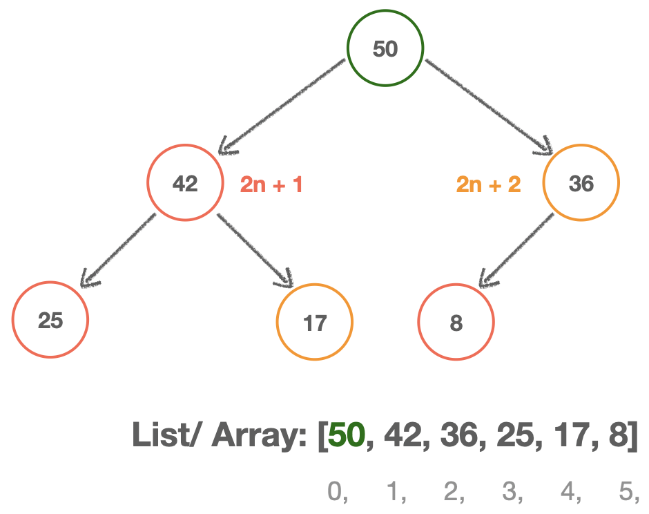

# Binary Heap(이진 힙)

- 각 부모 노드가 _최대 두개_ 의 자식 노드 가지는 **트리**

- 형제 노드 간 특별한 순서나 규칙 없음

- 좌·우측 노드 먼저 채우고 다음 레벨로 이동

  ❌한쪽으로 치우친(skewed) 모양의 트리 불가능❌

  

- **_정렬_**(우선순위 큐 등) 할 때 유리한 자료구조

## Max Binary Heap

- 부모 노드가 항상 자식 노드보다 **크다**

  

## Min Binary Heap

- 부모 노드가 항상 자식 노드보다 **작다**

  

### ※ Heap relationship

- n번째 인덱스의 **_부모_** 노드에 대해서

  - 왼쪽 자식 노드: `2n + 1`
  - 오른쪽 자식 노드: `2n + 2`

- n번째 인덱스의 **_자식_** 노드에 대해서

  - 부모 노드: `(n-1) / 2`
    (Math.floor)

---

```js
// Max Binary Heap
class MaxBinaryHeap {
  constructor() {
    this.values = [];
  }

  // Add value to heap
  insert(val) {
    // 1) Add value to the end
    this.values.push(val);
    // 2) Bubble up
    this.bubbleUp();
    return this.values;
  }

  // Find position for added value
  bubbleUp() {
    let idx = this.values.length - 1,
      element = this.values[idx]; // Find inserted item

    // Unless index reaches 0(largest element)
    while (idx > 0) {
      let parentIdx = Math.floor((idx - 1) / 2),
        parent = this.values[parentIdx]; // Find parent
      // If parent is greater than or equal to child, break
      if (element <= parent) break;
      // Otherwise, swap the values
      this.values[parentIdx] = element;
      this.values[idx] = parent;
      // Update index to be parentIndex
      idx = parentIdx;
    }
  }

  // Remove the max value(Extract Max)
  extractMax() {
    const max = this.values[0]; // Store the first(max) value
    const end = this.values.pop(); // Pop the last value
    // 1) Remove the root & Replace root with the most recently added
    // Swap the first value with the last one
    if (this.values.length > 0) {
      this.values[0] = end;
      // 2) Adjust(sink down)
      this.sinkDown();
    }
    return max;
  }

  // Find position for new root
  sinkDown() {
    let idx = 0; // Starts from the root
    const legnth = this.values.length;
    const element = this.values[0]; // Try to position element(new root)

    while (true) {
      let leftChildIdx = 2 * idx + 1,
        rightChildIdx = 2 * idx + 2;
      let leftChild, rightChild;
      let swap = null;
      // left side(not out of bound)
      if (leftChildIdx < length) {
        leftChild = this.values[leftChildIdx];
        // If left child is greater than element
        if (leftChild > element) {
          swap = leftChildIdx; // Keep track of largest index
        }
      }
      // right side(not out of bound)
      if (rightChildIdx < length) {
        rightChild = this.values[rightChildIdx];
        // If swap is not set & right child is greater than element
        if (
          (swap === null && rightChild > element) ||
          // OR swap is set & right child is greater than left child
          (swap !== null && rightChild > leftChild)
        ) {
          swap = rightChildIdx; // Keep track of largest index
        }
      }

      if (swap === null) break;
      this.values[idx] = this.values[swap];
      this.values[swap] = element;
      idx = swap;
    }
  }
}
let heap = new MaxBinaryHeap();
heap.insert(50);
heap.insert(42);
heap.insert(36);
heap.insert(25);
heap.insert(17);
heap.insert(8);
// [50, 42, 36, 25, 17, 8]
```

---

## Priority Queue(우선순위 큐)

- **높은 우선순위**를 가진 요소를 낮은 우선순위의 요소보다 **_먼저 처리_** 하는 자료구조

```js
class Node {
  constructor(val, priority) {
    this.val = val;
    this.priority = priority; // ⭐️
  }
}

// (cf) Max Binary Heap - higher number means higher priority)
// Min Binary Heap - lower number means higher priority
class PriorityQueue {
  constructor() {
    this.values = [];
  }

  // Accepts value & priority, arrange heap based on priority
  enqueue(val, priority) {
    let newNode = new Node(val, priority);
    this.values.push(newNode);
    this.bubbleUp();
  }

  bubbleUp() {
    let idx = this.values.length - 1;
    const element = this.values[idx]; // Find inserted item

    // Unless index reaches 0(largest element)
    while (idx > 0) {
      let parentIdx = Math.floor((idx - 1) / 2),
        parent = this.values[parentIdx]; // Find parent
      // If parent is greater than or equal to child, break
      if (element.priority >= parent.priority) break;
      // Otherwise, swap the values
      this.values[parentIdx] = element;
      this.values[idx] = parent;
      // Update index to be parentIndex
      idx = parentIdx;
    }
  }

  // Removes root element, rearrange heap
  dequeue() {
    const max = this.values[0];
    const end = this.values.pop();
    if (this.values.length > 0) {
      this.values[0] = end;
      this.sinkDown();
    }
    return max;
  }

  sinkDown() {
    let idx = 0; // Starts from the root
    const legnth = this.values.length;
    const element = this.values[0]; // Try to position element(new root)

    while (true) {
      let leftChildIdx = 2 * idx + 1,
        rightChildIdx = 2 * idx + 2;
      let leftChild, rightChild;
      let swap = null;
      // left side(not out of bound)
      if (leftChildIdx < length) {
        leftChild = this.values[leftChildIdx];
        // If left child is greater than element
        if (leftChild.priority < element.priority) {
          swap = leftChildIdx; // Keep track of largest index
        }
      }
      // right side(not out of bound)
      if (rightChildIdx < length) {
        rightChild = this.values[rightChildIdx];
        // If swap is not set & right child is greater than element
        if (
          (swap === null && rightChild.priority < element.priority) ||
          // OR swap is set & right child is greater than left child
          (swap !== null && rightChild.priority < leftChild.priority)
        ) {
          swap = rightChildIdx; // Keep track of largest index
        }
      }

      if (swap === null) break;
      this.values[idx] = this.values[swap];
      this.values[swap] = element;
      idx = swap;
    }
  }
}

let priority = new PriorityQueue();
priority.enqueue("Do the dishes", 1);
priority.enqueue("Pay the bills", 5);
priority.enqueue("Take a profile picture", 4);
priority.enqueue("Buy milk", 2);
priority.enqueue("Shoot a video log", 3);
```

## Big-O of Binary Heap

| Methods              | Time(Best)       | Time(Worst)      | Space Complexity |
| -------------------- | ---------------- | ---------------- | ---------------- |
| Insertion(insert)    | **`O(log n)`**   | **`O(log n)`**   | `O(n)`           |
| Deletion(extractMax) | **`O(log n)`**   | **`O(log n)`**   | `O(n)`           |
| Search(for value)    | `O(n)`           | `O(n)`           | `O(n)`           |
| Heapsort             | **`O(n log n)`** | **`O(n log n)`** | **`O(1)`**       |
