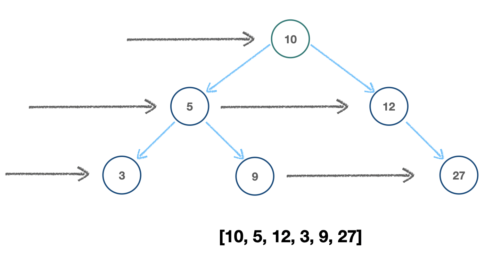
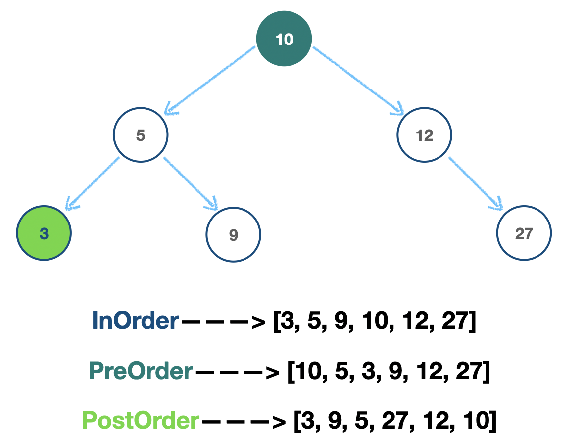

# Tree Traversal(트리 순회)

- 트리의 각 노드를 _한번씩 방문(visit every node once)_ 하는 과정

  ## BFS(Breadth First Search)

  

  - 모든 노드를 단계 별로 **수평** 방향으로 순회

  - **형제** 노드 ⇒ 자식 노드

    ```js
    class Node {
      constructor(val) {
        this.val = val;
        this.left = null;
        this.right = null;
      }
    }

    class BinarySearchTree {
      constructor() {
        this.root = null;
      }

      // Add value to BST
      insert(val) {
        let newNode = new Node(val);
        if (this.root === null) {
          this.root = newNode;
          return this;
        }
        let node = this.root; // current node
        while (true) {
          if (val === node.val) return undefined; // NO duplicates!
          // left
          if (val < node.val) {
            if (node.left === null) {
              node.left = newNode;
              return this;
            }
            node = node.left; // Move downward
            // right
          } else {
            if (node.right === null) {
              node.right = newNode;
              return this;
            }
            node = node.right; // Move downward
          }
        }
      }

      // BFS
      BFS() {
        let node = this.root,
          queue = [],
          visited = []; // Store values of nodes visited
        // Push root node in the queue
        queue.push(this.root);
        // Loop while queue is not empty
        while (queue.length) {
          // Dequeue a node from queue(shift)
          node = queue.shift();
          // Add dequeued node to visited
          visited.push(node.val);
          // If left node exists, push to queue
          if (node.left) queue.push(node.left);
          // If right node exists, push to queue
          if (node.right) queue.push(node.right);
        }
        return visited;
      }
    }

    let BST = new BinarySearchTree();
    BST.root = new Node(10);
    BST.insert(5);
    BST.insert(12);
    BST.insert(3);
    BST.insert(9);
    BST.insert(27);

    BST.BFS(); // [10, 5, 12, 3, 9, 27]
    ```

  ## DFS(Depth First Search)

  

  - 모든 노드를 **수직** 방향으로 순회

  - **자식** 노드 ⇒ 형제 노드

    ```js
    class Node {
      constructor(val) {
        this.val = val;
        this.left = null;
        this.right = null;
      }
    }

    class BinarySearchTree {
      constructor() {
        this.root = null;
      }

      // Add value to BST
      insert(val) {
        let newNode = new Node(val);
        if (this.root === null) {
          this.root = newNode;
          return this;
        }
        let node = this.root; // current node
        while (true) {
          if (val === node.val) return undefined; // NO duplicates!
          // left
          if (val < node.val) {
            if (node.left === null) {
              node.left = newNode;
              return this;
            }
            node = node.left; // Move downward
            // right
          } else {
            if (node.right === null) {
              node.right = newNode;
              return this;
            }
            node = node.right; // Move downward
          }
        }
      }

      // DFS - PreOrder
      // root => left => right node
      DFSPreOrder() {
        let visited = [],
          current = this.root; // Store the root
        // helper function
        function traverse(node) {
          // Visit a node & push to visited
          visited.push(node.val);
          // Traverse the entire left side
          if (node.left) traverse(node.left);
          // Traverse the entire right side
          if (node.right) traverse(node.right);
        }
        // Start from the root
        traverse(current);
        return visited;
      }

      // DFS - PostOrder
      // left => right => root node
      DFSPostOrder() {
        let visited = [],
          current = this.root; // Store the root
        // helper function
        function traverse(node) {
          // Traverse the entire left side
          if (node.left) traverse(node.left);
          // Traverse the entire right side
          if (node.right) traverse(node.right);
          // Visit a node & push to visited
          visited.push(node.val);
        }
        // Start from the root
        traverse(current);
        return visited;
      }

      // DFS - InOrder
      // left => root => right node
      DFSInOrder() {
        let visited = [],
          current = this.root; // Store the root
        // helper function
        function traverse(node) {
          // Traverse the entire left side
          if (node.left) traverse(node.left);
          // Visit a node & push to visited
          visited.push(node.val);
          // Traverse the entire right side
          if (node.right) traverse(node.right);
        }
        // Start from the root
        traverse(current);
        return visited;
      }
    }

    let BST = new BinarySearchTree();
    BST.root = new Node(10);
    BST.insert(5);
    BST.insert(12);
    BST.insert(3);
    BST.insert(9);
    BST.insert(27);

    BST.DFSPreOrder(); // [10, 5, 3, 9, 12, 27]
    BST.DFSPostOrder(); // [3, 9, 5, 27, 12, 10]
    BST.DFSInOrder(); //  [3, 5, 9, 10, 12, 27]
    ```

---

### Reference

[BFS/DFS](https://github.com/WeareSoft/tech-interview/blob/master/contents/algorithm.md)
