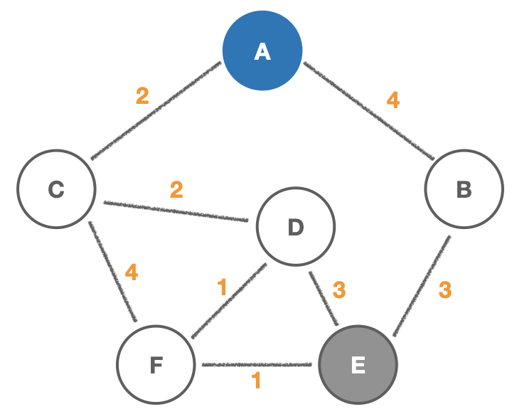

# Dijkstra's Algorithm(다익스트라 알고리즘)

- 가중 그래프(Weighted Graph)에서 `vertex`(꼭지점) 간의 **최단 경로** 찾는 알고리즘

- "A지점에서 B지점으로 가는 _가장 빠른_ 방법"

- 예시) GPS, 네트워크 라우팅, 항공권 등

---

## Weighted graph(가중 그래프)

```js
// Weighted graph
// { "A": [{ node: "B", weigt: 50 }, { node: "C", weigt: 13 }] ...}
class Graph {
  constructor() {
    this.adjacencyList = {};
  }
  addVertex(vertex) {
    if (!this.adjacencyList[vertex]) this.adjacencyList[vertex] = [];
  }
  addEdge(vertex1, vertex2, weight) {
    this.adjacencyList[vertex1].push({ node: vertex2, weight });
    this.adjacencyList[vertex2].push({ node: vertex1, weight });
  }
}

let graph = new Graph();
graph.addVertex("A");
graph.addVertex("B");
graph.addVertex("C");

graph.addEdge("A", "B", 9);
graph.addEdge("A", "C", 5);
graph.addEdge("B", "C", 7);
```

## Priority Queue(우선순위 큐)

```js
// simple priority queue(O(N * log(N)))
class PriorityQueue {
  constructor() {
    this.values = [];
  }
  // Add items by order
  enqueue(val, priority) {
    this.values.push({ val, priority });
    this.sort();
  }
  // Get the smallest item
  dequeue() {
    return this.values.shift();
  }
  sort() {
    this.values.sort((a, b) => a.priority - b.priority);
  }
}
let priorQ = new PriorityQueue();
priorQ.enqueue("A", 15);
priorQ.enqueue("B", 7);
priorQ.enqueue("C", 29);
priorQ.enqueue("D", 11);
priorQ.enqueue("E", 5);

priorQ.dequeue(); // {val: "E", priority: 5}
```

## Dijkstra's Algorithm



```js
class PriorityQueue {
  constructor() {
    this.values = [];
  }
  // Add items by order
  enqueue(val, priority) {
    this.values.push({ val, priority });
    this.sort();
  }
  // Get the smallest item
  dequeue() {
    return this.values.shift();
  }
  sort() {
    this.values.sort((a, b) => a.priority - b.priority);
  }
}

class WeightedGraph {
  constructor() {
    this.adjacencyList = {};
  }
  addVertex(vertex) {
    if (!this.adjacencyList[vertex]) this.adjacencyList[vertex] = [];
  }
  addEdge(vertex1, vertex2, weight) {
    this.adjacencyList[vertex1].push({ node: vertex2, weight });
    this.adjacencyList[vertex2].push({ node: vertex1, weight });
  }
  Dijkstra(start, finish) {
    const nodes = new PriorityQueue();
    const distances = {};
    const previous = {};
    let path = []; // shortest path
    let smallest;

    // Build up initial distances(A: 0, else:  Infinity)
    for (let vertex in this.adjacencyList) {
      if (vertex === start) {
        distances[vertex] = 0;
        nodes.enqueue(vertex, 0);
      } else {
        distances[vertex] = Infinity;
        nodes.enqueue(vertex, Infinity);
      }
      previous[vertex] = null;
    }

    // While priority queue's value not empty
    while (nodes.values.length) {
      smallest = nodes.dequeue().val; // current smallest value
      // END CASE!!!
      if (smallest === finish) {
        while (previous[smallest]) {
          path.push(smallest);
          smallest = previous[smallest];
        }
        break;
      }
      if (smallest || distances[smallest] !== Infinity) {
        for (let neighbor in this.adjacencyList[smallest]) {
          // Find neighboring node
          let nextNode = this.adjacencyList[smallest][neighbor];
          // Calculate new distance to neighboring node
          let candidate = distances[smallest] + nextNode.weight;
          let nextNeighbor = nextNode.node;
          if (candidate < distances[nextNeighbor]) {
            // Update new smallest distance to neighbor
            distances[nextNeighbor] = candidate;
            // Update previous - How we got to neighbor
            previous[nextNeighbor] = smallest;
            // Enqueue in priority queue with new priority
            nodes.enqueue(nextNeighbor, candidate);
          }
        }
      }
    }
    return path.concat(smallest).reverse();
  }
}

var graph = new WeightedGraph();
graph.addVertex("A");
graph.addVertex("B");
graph.addVertex("C");
graph.addVertex("D");
graph.addVertex("E");
graph.addVertex("F");

graph.addEdge("A", "B", 4);
graph.addEdge("A", "C", 2);
graph.addEdge("B", "E", 3);
graph.addEdge("C", "D", 2);
graph.addEdge("C", "F", 4);
graph.addEdge("D", "E", 3);
graph.addEdge("D", "F", 1);
graph.addEdge("E", "F", 1);

graph.Dijkstra("A", "E"); // ["A", "C", "D", "F", "E"]
graph.Dijkstra("A", "F"); // ["A", "C", "D", "F"]
```

---

### Reference

[Dijkstra's Algorithm](https://ko.wikipedia.org/wiki/%EB%8D%B0%EC%9D%B4%ED%81%AC%EC%8A%A4%ED%8A%B8%EB%9D%BC_%EC%95%8C%EA%B3%A0%EB%A6%AC%EC%A6%98)
