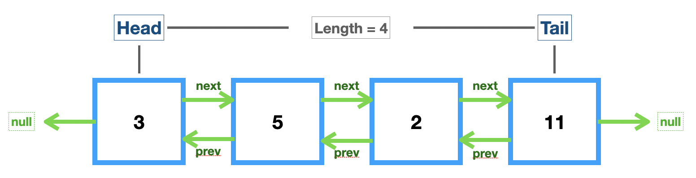

# Linked List

## Doubly Linked List



- 모든 노드가 **_양방향 포인터(↔️)_** 를 가진다는 점을 제외하고 Singly Linked List와 거의 동일

  - 노드 탐색(`get` 메소드)에 대한 _시간 복잡도는 1/2로 감소_ 하지만, 이전 노드를 향하는 포인터(pointer)도 포함하기 때문에 메모리 사용량이 늘어나 _공간 복잡도는 증가_

```js
class Node {
  constructor(val) {
    this.val = val;
    this.next = null;
    this.prev = null; // ✅
  }
}

class DoublyLinkedList {
  constructor() {
    this.head = null;
    this.tail = null;
    this.length = 0;
  }

  // Add a node to the end
  push(val) {
    let newNode = new Node(val);
    // if (this.length === 0) {
    if (!this.head) {
      this.head = newNode;
      this.tail = newNode;
    }
    this.tail.next = newNode;
    newNode.prev = this.tail; // ✅
    this.tail = newNode; // new tail
    this.length++;
    return this;
  }

  // Remove a node from the end
  pop() {
    if (!this.head) return undefined;
    let removed = this.tail; // popped node

    if (this.length === 1) {
      this.head = null;
      this.tail = null;
    } else {
      // Change tail to be tail.prev(move backward)
      this.tail = removed.prev;
      // Set new tail's next to null
      this.tail.next = null;
      // Set old tail's prev to null
      removed.prev = null; // ✅
    }
    this.length--;
    return removed;
  }

  // Remove a node from the beginning
  shift() {
    if (this.length === 0) return undefined;
    let removed = this.head; // shifted node

    if (this.length === 1) {
      this.head = null;
      this.tail = null;
    } else {
      // Change head to be head.next(move forward)
      this.head = removed.next;
      // Set new head's prev to null
      this.head.prev = null; // ✅
      // Set old head's next to null
      removed.next = null;
    }
    this.length--;
    return removed;
  }

  // Add a node to the beginning
  unshift(val) {
    let newNode = new Node(val);

    if (this.length === 0) {
      this.head = newNode;
      this.tail = newNode;
    } else {
      // Set old head's prev to be new node
      this.head.prev = newNode;
      // Set new head's next to be old head
      newNode.next = this.head;
      // Change head to be new node
      this.head = newNode;
    }
    this.length++;
    return this;
  }

  // ⭐️ Access a node by its position
  // Unoptimized(head => end)
  // get(idx) {
  //   if (idx < 0 || idx >= this.length) return null; // edge case
  //   let count = 0;
  //   let current = this.head;
  //   while (count !== index) {
  //     current = current.next;
  //     count++;
  //   }
  //   return current;
  // }

  // Optimized
  get(idx) {
    // If idx is invalid, return null
    if (idx < 0 || idx >= this.length) return null;
    let count, current;
    // head => mid
    if (idx <= Math.floor(this.length / 2)) {
      count = 0;
      current = this.head;
      while (count !== idx) {
        current = current.next;
        count++;
      }
      //  mid <= end
    } else {
      count = this.length - 1;
      current = this.tail;
      while (count !== idx) {
        current = current.prev;
        count--;
      }
    }
    return current;
  }
  // Replace the value of a node
  set(idx, val) {
    let getNode = this.get(idx);
    // If get method returns valid node, return true
    if (getNode !== null) {
      getNode.val = val;
      return true;
    }
    // Otherwise, return false
    return false;
  }

  // Add a node at a certain position
  insert(idx, val) {
    // If idx is invalid, return false
    if (idx < 0 || idx >= this.length) return false;
    // If the idx is 0, unshift
    if (idx === 0) return this.unshift(val);
    // If the idx === length, push
    if (idx === this.length) return this.push(val);

    // Otherwise, use get method to access idx - 1
    let newNode = new Node(val);
    let beforeNode = this.get(idx - 1);
    let afterNode = beforeNode.next;

    // beforeNode <-> newNode <-> afterNode
    (beforeNode.next = newNode), (newNode.prev = beforeNode);
    (newNode.next = afterNode), (afterNode.prev = newNode);

    this.length++;
    return true;
  }

  // Remove a node at a certain position
  remove(idx) {
    if (idx < 0 || idx >= this.length) return undefined;
    if (idx === 0) return this.shift();
    if (idx === this.length - 1) return this.pop();

    let getNode = this.get(idx);
    let beforeNode = getNode.prev;
    let afterNode = getNode.next;
    // Connect the next, prev props to remove the getNode
    beforeNode.next = afterNode;
    afterNode.prev = beforeNode;

    // Set next, prev to null
    getNode.next = null;
    getNode.prev = null;

    this.length--;
    return getNode;
  }
}

let list = new DoublyLinkedList();
list.push("Hello");
list.push("World");
list.push("🖐🏻");
list.push("🙇🏻‍♀️");
```

## Big-O of Doubly Linked List

| Methods                  | Complexity               |
| ------------------------ | ------------------------ |
| Insertion(push, unshift) | **`O(1)`**               |
| Deletion(remove)         | **_`O(1)`_**             |
| Search(for value)        | **_`O(n/2)`_** => `O(n)` |
| Access(by index)         | `O(n)`                   |

💚[Big-O Cheatsheet](https://www.bigocheatsheet.com/)
