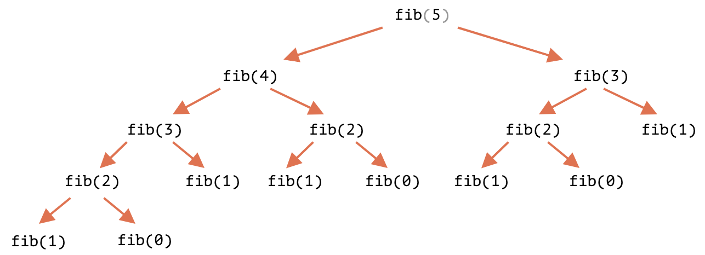
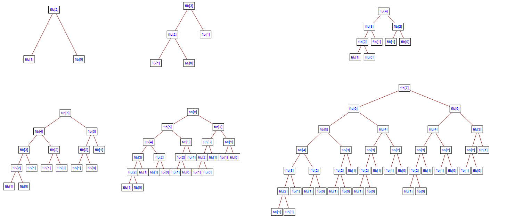

# Dynamic Programming(동적 계획법)

- 복잡한 문제를 좀 더 간단한 하위문제(subproblem) 집합으로 나누어, 각 하위문제를 한 번씩 풀고, 그 해결책을 **저장**(중복 관리) 하여 해결하는 방법

## ※ DP로 풀 수 있는 문제의 특성

1. `Overlapping Subproblems`

- _여러 번 재사용 가능한_ 하위 문제(subproblem)로 나눌 수 있는 문제

  - 예시) 피보나치 수열
    

    ```js
    // recursion(unoptimized)
    function fib(n) {
      // fib(1) = fib(2) = 1
      return n <= 1 ? n : fib(n - 1) + fib(n - 2);
    }

    // iteration(optimized)
    function fib(n) {
      let a = 1,
        b = 1;
      for (let i = 3; i <= n; i++) {
        let c = a + b;
        a = b;
        b = c;
      }
      return b;
    }

    fib(50); // 12586269025
    ```

2. `Optimal Substructure`

- 최적(optimal)의 솔루션을 _하위문제(subproblem)의 최적 솔루션으로 구성_ 할 수 있는 문제

  - 예시) 최단 경로(shortest path)

    ```
    // 최적 경로
    A => B => C => D

    A => B,
    B => C,
    C => D
    ```

---

## Memoization: Top-Down

- 함수 호출 결과를 저장하고, 동일한 입력이 다시 발생하면 캐시된(cached) 결과를 반환(동일 계산의 반복 수행 제거)

```js
// memoization
// recursion(fib(n) = fib(n-1) + fib(n-2))
function fib(n, memo = [undefined, 1, 1]) {
  // if not undefined
  if (memo[n]) return memo[n];

  if (n <= 2) return 1;

  let result = fib(n - 1, memo) + fib(n - 2, memo);
  memo[n] = result;
  // console.log(memo);
  return result;
}

fib(10); // 55
fib(50); // 12586269025
```

## Tabulation: Bottom-Up

- 이전 함수 호출 결과를 `table`(배열 등)에 저장하고, **반복문** 사용하여 해결

- Memoization보다 **공간 복잡도**에서 유리(overflow 방지)

```js
// tabulation
// iteration(fib[n] = fib[n-1] + fib[n-2])
function fib(n) {
  if (n <= 2) return 1;

  let fibNums = [0, 1, 1];

  for (let i = 3; i <= n; i++) {
    fibNums[i] = fibNums[i - 1] + fibNums[i - 2];
  }
  // console.log(fibNums);
  return fibNums[n];
}

fib(10); // 55
fib(50); // 12586269025
```

## Big-O of Fibonacci(Dynamic Programming)



| Methods     | Time Complexity | Space Complexity |
| ----------- | --------------- | ---------------- |
| Recursion   | `😈O(2^N)😈`    | `O(N)`           |
| Memoization | **`O(N)`**      | `O(N)`           |
| Tabulation  | **`O(N)`**      | `O(1)`           |

---

### Reference

[Dynamic Programming](https://ko.wikipedia.org/wiki/%EB%8F%99%EC%A0%81_%EA%B3%84%ED%9A%8D%EB%B2%95)

[Fibonacci](https://ko.javascript.info/task/fibonacci-numbers)
