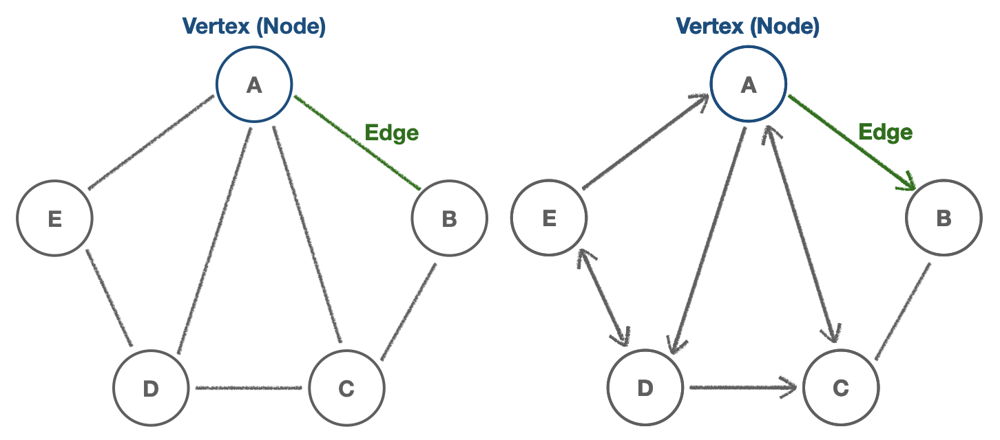
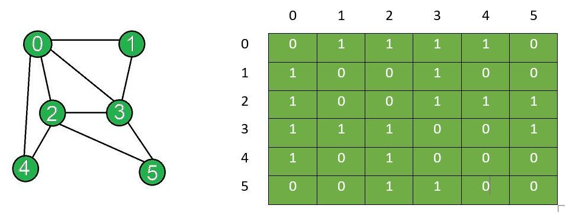

# Graph(그래프)

- `vertex`(정점, `node`)와 `edge`(간선, connection)로 구성된 유한한(finite) 자료구조

  

  - 예시) 소셜 네트워크, 위치/지도(Location/Mapping), 라우팅 알고리즘, 계층 구조((UX/UI)Visual hierarchy), File System Optimization(파일 시스템 최적화)

  ## Graph Type(그래프 종류)

  - **방향** 에 따라

    

  1. Undirected graph(무방향 그래프): `edge`의 방향이 존재하지 않는 것(`A-B`와 `B-A`가 동일)

  2. Directed graph(방향 그래프): `edge`의 방향이 존재(`A➡️B`)

  - **가중치** 에 따라

    

  1. Unweighted graph(비가중 그래프): `edge`가 가중치를 포함하지 않는 것

  2. Weighted graph(가중 그래프): `edge`가 가중치를 포함하는 것

     예시) 지도에서 위치 간 거리

  ## Adjacency Matrix(인접 행렬)

  - `vertex`와 `edge`의 연결 관계로 그래프를 나타내는 _정사각 행렬_

    - `vertex` 간 연결되어있으면(`edge` 존재하면) 1, 아니면 0(T/F)

    

  ## Adjacency List(인접 리스트)

  - 각 `vertex`에 연결된 `vertex`들을 *연결리스트*로 표현

  ```js
  // using array
  let list = [
    // 0, 1, 2, 3, 4, 5
    [1, 2, 3, 4],
    [0, 3],
    [0, 3, 4, 5],
    [0, 1, 2, 5],
    [0, 2],
    [2, 3],
  ];
  ```

  ```js
  // using hash table
  let list = {
    // A, B, C, D, E
    A: ["B", "C", "D", "E"],
    B: ["A", "C"],
    C: ["A", "B", "D"],
    D: ["A", "C", "E"],
    E: ["A", "D"],
  };
  ```

  ### ※ Adjacency Matrix과 List 비교

  | Adjacency List                         | Adjacency Matrix                       |
  | -------------------------------------- | -------------------------------------- |
  | 공간을 비교적 _적게_ 차지              | 공간을 비교적 _많이_ 차지              |
  | 밀도가 _낮은(sparse)_ 그래프에 유리    | 밀도가 _높은(dense)_ 그래프에 유리     |
  | 모든 `edge` 순회(iterate)하는데 _빠름_ | 모든 `edge` 순회(iterate)하는데 _느림_ |
  | 특정 `edge` 탐색하는데 _느림_          | 특정 `edge` 탐색하는데 _빠름_          |

## Big-O of Adjacency List & Matrix

- `|V|`: `vertex`(정점)의 총 개수
- `|E|`: `edge`(간선)의 총 개수

| Operations    | Adjacency List           | Adjacency Matrix |
| ------------- | ------------------------ | ---------------- |
| Add vertex    | `O(1)`                   | `O( \| V^2 \| )` |
| Add edge      | `O(1)`                   | `O(1)`           |
| Remove vertex | `O( \| V \| + \| E \| )` | `O( \| V^2 \| )` |
| Remove edge   | `O( \| E \| )`           | `O(1)`           |
| Query         | `O( \| V \| + \| E \| )` | `O(1)`           |
| Storage       | `O( \| V \| + \| E \| )` | `O( \| V^2 \| )` |

## Graph Class

```js
// undirected graph
class Graph {
  constructor() {
    this.adjacencyList = {};
  }

  // Add vertex
  // graph.addVertex("A") -- { "A": [] }
  addVertex(vertex) {
    // No duplicates
    if (!this.adjacencyList[vertex]) this.adjacencyList[vertex] = [];
    return this.adjacencyList;
  }

  // Add edge
  addEdge(vertex1, vertex2) {
    this.adjacencyList[vertex1].push(vertex2);
    this.adjacencyList[vertex2].push(vertex1);
    // directed graph(v1 -> v2)
    // this.adjacencyList[v1].push(v2);
    return this.adjacencyList;
  }

  // Remove vertex
  // Loop through the list and removeEdge
  // Delete the key for given vertex
  // removeVertex(vertex) {
  //   this.adjacencyList[vertex].forEach((v2) => this.removeEdge(vertex, v2));
  //   delete this.adjacencyList[vertex];
  //   return this.adjacencyList;
  // }
  removeVertex(vertex) {
    while (this.adjacencyList[vertex].length) {
      const adjacentVertex = this.adjacencyList[vertex].pop();
      this.removeEdge(vertex, adjacentVertex);
    }
    delete this.adjacencyList[vertex];
    return this.adjacencyList;
  }

  // Remove edge
  removeEdge(vertex1, vertex2) {
    this.adjacencyList[vertex1] = this.adjacencyList[vertex1].filter(
      (v) => v !== vertex2
    );
    this.adjacencyList[vertex2] = this.adjacencyList[vertex2].filter(
      (v) => v !== vertex1
    );
    return this.adjacencyList;
  }
}

let graph = new Graph();
graph.addVertex("Seoul");
graph.addVertex("Incheon");
graph.addVertex("Daejeon");
graph.addVertex("Daegu");
graph.addVertex("Busan");
graph.addVertex("Jeju");

graph.addEdge("Incheon", "Jeju");
graph.addEdge("Incheon", "Daegu");
graph.addEdge("Incheon", "Busan");
```

---

### Reference

[Graph | Wiki](<https://ko.wikipedia.org/wiki/%EA%B7%B8%EB%9E%98%ED%94%84_(%EC%9E%90%EB%A3%8C_%EA%B5%AC%EC%A1%B0)>)
