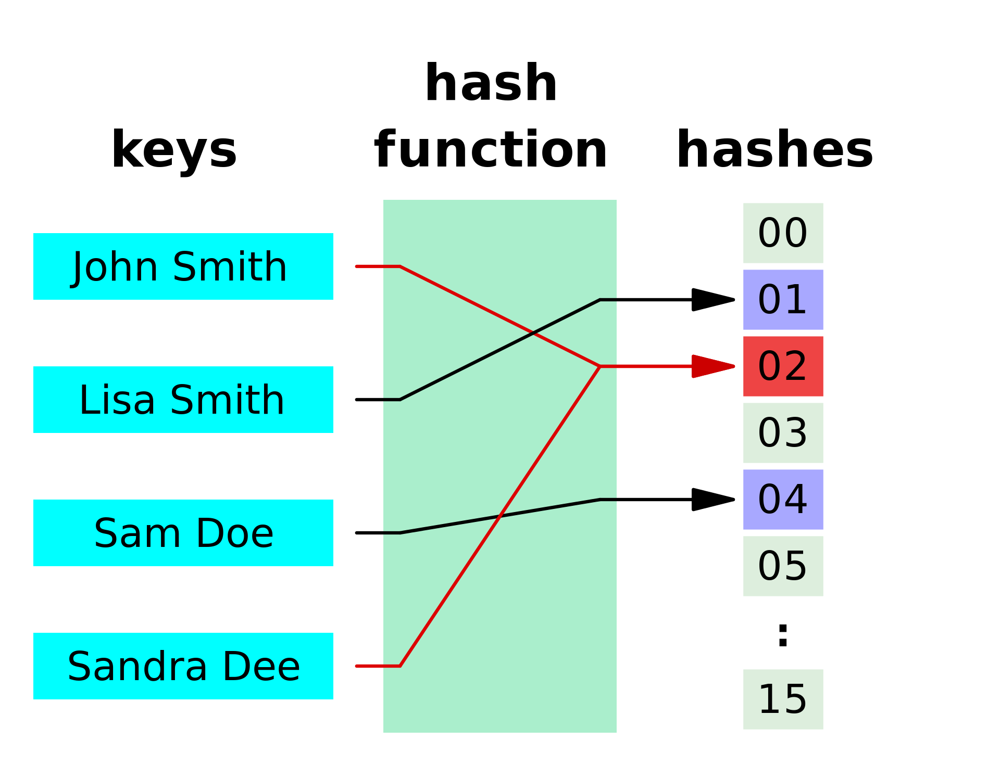

# Hash Table(Map)

- `key-value` pair를 저장하는 자료구조

  1. 배열의 index와 달리 _key값의 순서가 없다_

  2. 배열과 달리 _값 탐색·추가·삭제가 빠르다_

  3. 거의 모든 프로그래밍 언어에 내장된 `hash table` 존재

  ex) JS `Object`, `Maps`, Python `Dictionaries`, Java `Maps`

---

## Hash Function(해싱 함수)

- 동일한 `key`(문자열)에 대해서 항상 동일한 `index`값 출력하는 **단방향** 함수

  - ⭕️`key` ➡️ **Hash Function** ➡️ valid `index`

  - ❌ `key` ⬅️ **Hash Function** ⬅️ valid `index`

    ex) `Lisa Smith` ➡️ **Hash Function** ➡️ `01`

  ※ 적합한 해시 함수

  1. 빠르다(`O(1)`)
  2. 충돌이 없다(특정 index에 국한되지 않고, 균일하게 분산)
  3. _결정론적_ 으로 작동한다(동일한 입력 ➡️ 동일한 출력)

---

### Reference

[Hash Tables | CS50](https://www.youtube.com/watch?v=nvzVHwrrub0)

[Hash Function | Wiki](https://ko.wikipedia.org/wiki/%ED%95%B4%EC%8B%9C_%ED%95%A8%EC%88%98)
