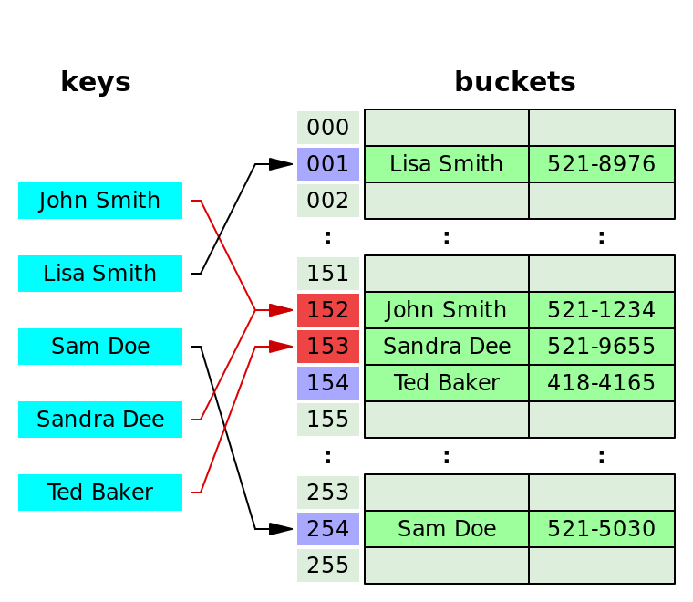

# Hash Table(Map)

- `key-value` 쌍을 저장하는 자료구조

  1. 배열의 index와 달리 _key값의 순서가 없다_

  2. 배열과 달리 _값 탐색·추가·삭제가 빠르다_

  3. 거의 모든 프로그래밍 언어에 내장된 `hash table` 존재

  ex) JS `Object`, `Maps`, Python `Dictionaries`, Java `Maps`

---

## Hash Function(해싱 함수)


- 동일한 `key`(문자열)에 대해서 항상 동일한 `index`값 출력하는 **단방향** 함수

  - ⭕️`key` ➡️ **Hash Function** ➡️ valid `index`

  - ❌ `key` ⬅️ **Hash Function** ⬅️ valid `index`

    ex) `Lisa Smith` ➡️ **Hash Function** ➡️ `01`

  ### ※ 해시 함수의 조건

  1. 빠르다(`O(1)`)
  2. 충돌이 없다(Distribute keys uniformly)
  3. _결정론적(deterministic)_ 으로 작동한다(동일한 입력 ➡️ 동일한 출력)

---

```js
// Simple Hash Function
/* 1. Only hashes strings(key)
   2. Not constant time (O(n))
   3. Could be more random
*/
function hash(key, arrayLeng) {
  let total = 0;
  for (let char of key) {
    let value = char.charCodeAt(0) - 96;
    total = (total + value) % arrayLeng;
  }
  return total;
}

hash("salmon", 10); // 4
hash("blue", 7); // 5
```

```js
// Refined Hash Function
// (Slightly better distributed)
function hash(key, arrayLeng) {
  let total = 0;
  // Add prime numbers to reduce collisions
  let WEIRD_PRIME = 31;

  // Set minimum to 100
  for (let i = 0; i < Math.min(key.length, 100); i++) {
    let char = key[i];
    let value = char.charCodeAt(0) - 96;
    // Set arrayLeng to decrease collisions(prime number)
    total = (total + WEIRD_PRIME + value) % arrayLeng;
  }
  return total;
}

hash("salmon", 10); // 4
hash("blue", 7); // 5
hash("yellow", 25); // 3
```

## 해시 함수의 충돌 관리 전략

- 규모가 큰 해시 함수도 충돌이 불가피하다

1. **Seperate chaining** : 각 `index`에 대해서 `value` 를 _상대적으로 복잡한 자료구조(배열, 연결 리스트 등)_ 에 저장하는 방법

- 다수의 `key-value` 쌍을 동일한 `index`에 저장 가능
  

  ```js
  // // key - value at same index '152'
  [
    ["John Smith", 521 - 1234],
    ["Sandra Dee", 521 - 9655],
  ];
  ```

2. **Linear Probing**: 충돌시 배열 탐색하여 비어있는 `index`을 찾는 방법

- 하나의 `key-value` 쌍을 하나의 `index`에 저장 가능
  

---

## Hash Table Class

```js
class HashTable {
  constructor(size = 50) {
    this.keyMap = new Array(size);
  }
  // Hash function
  _hash(key) {
    let total = 0;
    let WEIRD_PRIME = 31;
    for (let i = 0; i < Math.min(key.length, 100); i++) {
      let char = key[i];
      let value = char.charCodeAt(0) - 96;
      total = (total * WEIRD_PRIME + value) % this.keyMap.length;
    }
    return total;
  }
  // Set
  set(key, value) {
    // Hash a key
    let index = this._hash(key);
    // Store key-value pair(via seperate chaining)
    if (!this.keyMap[index]) {
      this.keyMap[index] = [];
    }
    this.keyMap[index].push([key, value]);
  }

  // Get
  get(key) {
    // Hash a key
    let index = this._hash(key);
    // Retrieve key-value pair
    if (this.keyMap[index]) {
      // Loop over key map & Check if the key matches
      for (let i = 0; i < this.keyMap[index].length; i++) {
        if (this.keyMap[index][i][0] === key) {
          // Return corresponding value
          return this.keyMap[index][i][1];
        }
      }
    }
    return undefined;
  }

  // Keys(array of keys)
  // (handle duplicate data)
  keys() {
    let keyArr = [];
    for (let pairs of this.keyMap) {
      if (pairs) {
        for (let pair of pairs) {
          if (!keyArr.includes(pair[0])) {
            keyArr.push(pair[0]);
          }
        }
      }
    }
    return keyArr;
  }

  // Values(array of values)
  // (handle duplicate data)
  values() {
    let valueArr = [];
    for (let pairs of this.keyMap) {
      if (pairs) {
        for (let pair of pairs) {
          if (!valueArr.includes(pair[1])) {
            valueArr.push(pair[1]);
          }
        }
      }
    }
    return valueArr;
  }
}
let hashTable = new HashTable(10);
hashTable.set("hello", "programming");
hashTable.set("welcome", "new things");
hashTable.set("goodbye", "nothing");
```

## Big-O of Hash Table

1. 해시 함수가 데이터를 균일하게 배분할 때(충돌이 없을 때)를 가정
2. `key` 탐색(Search): `O(1)` / `value` 탐색(Search): `O(n)`

| Methods        | Complexity of Hash Table | Complexity of Array |
| -------------- | ------------------------ | ------------------- |
| Insertion(set) | **`O(1)`**               | `O(n)`              |
| Deletion       | **`O(1)`**               | `O(n)`              |
| Access(get)    | **`O(1)`**               | **`O(1)`**          |

💚[Big-O Cheatsheet](https://www.bigocheatsheet.com/)

---

### Reference

[Hash Tables | CS50](https://www.youtube.com/watch?v=nvzVHwrrub0)

[Hash Function | Wiki](https://ko.wikipedia.org/wiki/%ED%95%B4%EC%8B%9C_%ED%95%A8%EC%88%98)
