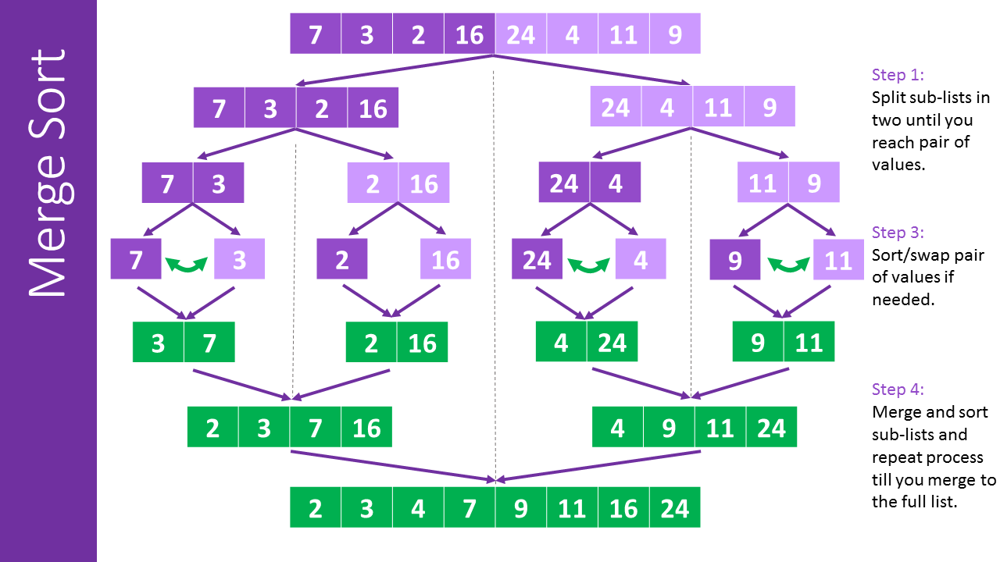

# Sorting(정렬)

## Merge Sort(병합 정렬)

- 배열의 요소가 1개가 될 때까지 배열을 1/2로 **분할**

- 분할한 배열의 요소들을 순서대로 _0번째 인덱스끼리_ 비교 · 정렬하여 **정복**

   

- **Big-O**: `O(n logn)`(time), `O(n)`(space)

  ```js
  // merge(helper)
  function merge(arr1, arr2) {
    let results = [];
    let i = 0; // pointer1
    let j = 0; // pointer2
    // While data exists in an array to compare
    while (i < arr1.length && j < arr2.length) {
      if (arr2[j] > arr1[i]) {
        results.push(arr1[i]);
        i++;
      } else {
        results.push(arr2[j]);
        j++;
      }
    }
    // Push remaining data in an array
    while (i < arr1.length) {
      results.push(arr1[i]);
      i++;
    }
    while (j < arr2.length) {
      results.push(arr2[j]);
      j++;
    }
    return results;
  }
  // merge sort
  function mergeSort(arr) {
    if (arr.length <= 1) return arr; // base case

    let mid = Math.floor(arr.length / 2);
    let left = mergeSort(arr.slice(0, mid));
    let right = mergeSort(arr.slice(mid));
    return merge(left, right);
  }
  mergeSort([10, 24, 76, 73]);
  // [10, 24, 73, 76])
  ```

## Quick Sort(퀵 정렬)

- **기준값(pivot)** 을 기준으로 그 값보다 **작은 요소는 좌측**에, **큰 요소는 우측**에 위치하도록 **분할**

  (※ **기준값(pivot)** 은 주로 처음, 중간, 끝 값 많이 사용)

- 좌우 분할된 리스트의 크기가 0또는 1이 될 때까지 **_재귀적으로 반복_**하여 정렬

  

- **Big-O**: `O(nlog2n)` (최악은 O(n^2))

  ```js
  // pivot(helper)
  function pivot(arr, start = 0, end = arr.length - 1) {
    const swap = (arr, i, j) => {
      return ([arr[i], arr[j]] = [arr[j], arr[i]]);
    };
    let pivot = arr[start]; // always first element
    let pivotIdx = start;

    for (let i = start + 1; i <= end; i++) {
      if (pivot > arr[i]) {
        pivotIdx++; // Count elements less than pivot
        swap(arr, pivotIdx, i);
        // console.log(arr1)
      }
    }
    // Swap the pivot & start index
    swap(arr, start, pivotIdx);
    // console.log(arr2)
    return pivotIdx;
  }
  // quick sort
  function quickSort(arr, left = 0, right = arr.length - 1) {
    // base case(when subarray is 1 element long)
    if (left < right) {
      let pivotIndex = pivot(arr, left, right); // 3
      // left side
      quickSort(arr, left, pivotIndex - 1);
      // right side
      quickSort(arr, pivotIndex + 1, right);
    }
    return arr;
  }

  quickSort([4, 6, 9, 1, 2, 5, 3]);
  // [1, 2, 3, 4, 5, 6, 9]
  ```

## Radix Sort(기수 정렬)

- 낮은 **자릿수**(digit)부터 비교하여 정렬(자릿수가 없는 부동소수점은 불가능, 문자열·정수는 가능/ 자릿수가 클수록 큰 수)

- **비교 정렬(Comparison Sort)** 을 하지 않아 _정렬 속도가 빠르지만_, 데이터 전체 크기(n)에 더해 자릿수(k)만한 메모리 필요

  ```js
  function getDigit(num, i) {
    return Math.floor(Math.abs(num) / Math.pow(10, i)) % 10;
  }

  function digitCount(num) {
    if (num === 0) return 1;
    return Math.floor(Math.log10(Math.abs(num))) + 1;
  }

  function mostDigits(nums) {
    let maxDigits = 0;
    for (let i = 0; i < nums.length; i++) {
      maxDigits = Math.max(maxDigits, digitCount(nums[i]));
    }
    return maxDigits;
  }

  function radixSort(nums) {
    // Get the digits of largest number
    let maxDigitCount = mostDigits(nums);

    for (let k = 0; k < maxDigitCount; k++) {
      // Create buckets for 0 ~ 9(an array of 10 empty sub arrays)
      let digitBuckets = Array.from({ length: 10 }, () => []);
      // Place each number in the kth digits bucket
      for (let i = 0; i < nums.length; i++) {
        // console.log(getDigit(nums[i], k))
        let digit = getDigit(nums[i], k);
        digitBuckets[digit].push(nums[i]);
      }
      // console.log("digitBuckets", digitBuckets);
      // Replace array with concated digitBucket array
      nums = [].concat(...digitBuckets);
      // console.log("nums", nums);
    }
    return nums;
  }

  radixSort([23, 345, 5467, 12, 2345, 9852]);
  // [12, 23, 345, 2345, 5467, 9852]
  ```

## Big-O Comparison

| Algorithm  | Time(Best)   | Time(Avg)    | Time(Worst)  | Space      |
| ---------- | ------------ | ------------ | ------------ | ---------- |
| Merge Sort | `O(n log n)` | `O(n log n)` | `O(n log n)` | `O(n)`     |
| Quick Sort | `O(n log n)` | `O(n log n)` | `O(n^2)`     | `O(log n)` |
| Radix Sort | **`O(nk)`**  | `O(nk)`      | `O(nk)`      | `O(n + k)` |

(※ n: length of an array, k: number of digits(average))

💚[Big-O Cheatsheet](https://www.bigocheatsheet.com/)
