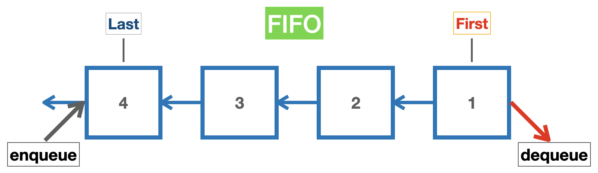

# Queue

- **FIFO**(First In, First Out)

  - 예시) 프린트/ 테스크 처리, 파일 업로드 등

  

  ### Queue using Array

  - 배열을 사용하면 큐를 _빠르고 쉽게_ 표현 가능

  ```js
  let queue = [];
  // push & shift(inefficient; re-indexing)
  queue.push("First");
  queue.push("Second");
  queue.push("Third");

  queue; // ["First", "Second", "Third"]

  queue.shift(); // "First"
  queue.shift(); // "Second"
  queue.shift(); // "Third"
  ```

  ```js
  let queue = [];
  // unshift & pop(efficient)
  queue.unshift("First");
  queue.unshift("Second");
  queue.unshift("Third");

  queue; // ["Third", "Second", "First"]

  queue.pop(); // "First"
  queue.pop(); // "Second"
  queue.pop(); // "Third"
  ```

  ### Queue using Linked List

  - 배열보다 **연결 리스트**로 큐를 표현하는데 _성능적으로 빠름_

  ```js
  class Node {
    constructor(val) {
      this.val = val;
      this.next = null;
    }
  }
  class Queue {
    constructor() {
      this.first = null; // front
      this.last = null; // back
      this.size = 0;
    }

    // Add to the end(last)
    enqueue(val) {
      let newNode = new Node(val);
      // If queue is empty
      if (!this.first) {
        this.first = newNode;
        this.last = newNode;
      } else {
        let current = this.last; // Store current last
        current.next = newNode; // Connect newNode to old last
        this.last = newNode; // Change last to new node
      }
      return ++this.size;
    }
    // queue.enqueue("ADD")

    // Remove from the beginning(first)
    dequeue() {
      // If queue is empty
      if (!this.first) return null;
      let current = this.first; // Store current first
      // If there is only one node
      if (this.first === this.last) {
        this.last = null;
      } else {
        // Set first to be next of old first(current)
        this.first = current.next;
      }
      this.size--;
      return current.val;
    }
    // queue.dequeue()
  }

  let queue = new Queue();
  queue.enqueue("1️⃣");
  queue.enqueue("2️⃣");
  queue.enqueue("3️⃣");
  ```

## Big-O of Queue

| Methods            | Complexity of Queue | Complexity of Array |
| ------------------ | ------------------- | ------------------- |
| Insertion(enqueue) | **`O(1)`**          | `O(n)`              |
| Deletion(dequeue)  | **`O(1)`**          | `O(n)`              |
| Search(for value)  | `O(n)`              | `O(n)`              |
| Access             | `O(n)`              | **`O(1)`**          |

💚[Big-O Cheatsheet](https://www.bigocheatsheet.com/)
