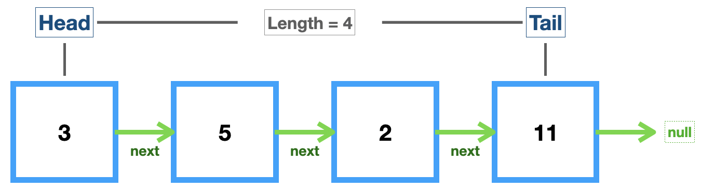

# Linked List

## Singly Linked List



- _머리, 꼬리, 길이_ 속성을 가진 자료구조. 한 방향으로 이동 가능(➡️)

- **노드**(값(value)과 다음 노드로 향하는 포인터(pointer)를 포함)로 구성 => `Stack`과 `Queue`의 기초

- 배열과 달리 _인덱스가 없기 때문에_ 특정 인덱스에 바로 접근하는 것은 어렵지만 요소의 삽입과 삭제는 용이함

```js
class Node {
  constructor(val) {
    this.val = val;
    this.next = null;
  }
}

// let first = new Node("Hello");
// first.next = new Node("World");

class SinglyLinkedList {
  constructor() {
    this.head = null;
    this.tail = null;
    this.length = 0;
  }
  // Add new node to the end
  push(val) {
    let newNode = new Node(val);
    if (!this.head) {
      this.head = newNode;
      this.tail = this.head;
    } else {
      this.tail.next = newNode;
      this.tail = newNode;
    }
    this.length++;
    return this;
  }

  // Traverse
  traverse() {
    let current = this.head;
    while (current) {
      // console.log(current.val);
      current = current.next;
    }
  }

  // Remove a node from the end
  pop() {
    // if (!this.head) return undefined;
    if (this.length === 0) return undefined;
    let current = this.head;
    let previous = current;

    while (current.next) {
      previous = current;
      current = current.next;
    }
    this.tail = previous; // new tail
    this.tail.next = null; // pop
    this.length--;
    // Only one element left in the linked list...
    if (this.length === 0) {
      this.head = null;
      this.tail = null;
    }
    return current;
  }

  // Remove node from the beginning
  shift() {
    if (!this.head) return undefined;
    let current = this.head; // current head
    this.head = current.next;
    this.length--;
    if (this.length === 0) {
      this.tail = null;
    }
    return current;
  }

  // Add new node to the beginning
  unshift(val) {
    let newNode = new Node(val);

    if (!this.head) {
      this.head = newNode;
      this.tail = this.head;
    } else {
      newNode.next = this.head;
      this.head = newNode;
    }
    this.length++;
    return this;
  }

  // Get a node by it's position
  get(idx) {
    let count = 0;
    let current = this.head;
    // If index is invalid, return null
    if (idx < 0 || idx >= this.length) return null;

    while (count !== idx) {
      current = current.next;
      count++;
    }
    return current;
  }

  // Change the value of a node on given position
  set(idx, val) {
    let getNode = this.get(idx);
    if (getNode) {
      getNode.val = val;
      return true;
    }
    return false;
  }
  // list.set("👌🏻",2)  // true

  // Add a node at a specific position
  // previous <- newNode -> current
  insert(idx, val) {
    if (idx < 0 || idx > this.length) return false;
    if (idx === this.length) return !!this.push(val); // true
    if (idx === 0) return !!this.unshift(val); // true

    let newNode = new Node(val);
    let previous = this.get(idx - 1); // previous node
    let temp = previous.next; // current node
    previous.next = newNode;
    newNode.next = temp;
    this.length++;
    return true;
  }
  // list.insert(0, "FIRST") // true
  // list.insert(4, "LAST")  // true

  // Remove a node at a specific position
  remove(idx) {
    if (idx < 0 || idx > this.length) return undefined;
    if (idx === 0) return this.shift();
    if (idx === this.length - 1) return this.pop();

    let previous = this.get(idx - 1);
    let removed = previous.next;

    previous.next = removed.next;
    this.length--;
    return removed;
  }

  // Prints all the values in array by order
  print() {
    let arr = [];
    let curr = this.head;

    while (curr) {
      arr.push(curr.val);
      curr = curr.next;
    }
    console.log(arr);
  }

  // ⭐️Reverse the linked list in place!!!
  //   head <-> tail. prev <-> next
  reverse() {
    // Swap head and tail
    let node = this.head;
    this.head = this.tail;
    this.tail = node;

    let prev = null, // tail is null
      next;

    // Loop through the list
    for (let i = 0; i < this.length; i++) {
      // Store current next
      next = node.next;
      // Change next to be prev
      node.next = prev;
      // Move forward
      prev = node;
      node = next;
      // console.log(prev, node, next);
      /* (1) ["Hello", "World", "🖐🏻"]
               NODE     NEXT
             "Hello" -> null
              PREV     NODE
              "Hello" "World"
          (2) "🖐🏻"
              NEXT 
              "World" -> "Hello" -> null
               PREV     NODE
              "World"   "🖐🏻"
          (3) null
              NEXT
              "🖐🏻" -> "World" -> "Hello" -> null
              PREV     NODE
              "🖐🏻"     null  => end of the loop  
      */
    }
    return this;
  }
  // list.print()    // ["Hello", "World", "🖐🏻"]
  // list.reverse()
  // list.print()    // ["🖐🏻", "World", "Hello"]
}

let list = new SinglyLinkedList();
list.push("Hello");
list.push("World");
list.push("🖐🏻");
```

## Big-O of Singly Linked List

| Methods                  | Complexity           |
| ------------------------ | -------------------- |
| Insertion(push, unshift) | **`O(1)`**           |
| Deletion(remove)         | **`O(1)`** => `O(n)` |
| Search(for value)        | `O(n)`               |
| Access(by index)         | `O(n)`               |

💚[Big-O Cheatsheet](https://www.bigocheatsheet.com/)
