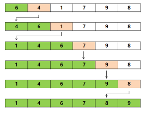

# Sorting(정렬)

## Bubble Sort(버블 정렬)

- 배열의 두 인접한 요소를 검사하여 크기 순 정렬(작은 값 <-> 큰 값 교환)

- **Big-O**: `O(n^2)` (※ 최적화(거의 정렬된 배열): `O(n)`)

  ```js
  // Not Optimized: O(n^2)
  function bubbleSort(arr) {
    // Start looping from the end of the array
    for (let i = arr.length; i > 0; i--) {
      // Start inner loop from beginning til i - 1(shrinking)
      for (j = 0; j < i - 1; j++) {
        console.log(arr, arr[j], arr[j + 1]);

        if (arr[j] > arr[j + 1]) {
          // SWAP
          let temp = arr[j];
          arr[j] = arr[j + 1];
          arr[j + 1] = temp;
        }
      }
      console.count("loop");
    }
    return arr;
  }

  bubbleSort([6, 3, 10, 28, 5]);
  // [3, 5, 6, 10, 28]
  ```

  ```js
  // ES6+
  function bubbleSort(arr) {
    const swap = (arr, idx1, idx2) => {
      [arr[idx1], arr[idx2]] = [arr[idx2], arr[idx1]];
    };
    for (let i = arr.length; i > 0; i--) {
      for (let j = 0; j < i - 1; j++) {
        if (arr[j] > arr[j + 1]) {
          swap(arr, j, j + 1);
        }
      }
    }
    return arr;
  }

  bubbleSort([6, 3, 10, 28, 5]);
  // [3, 5, 6, 10, 28]
  ```

  ```js
  // Optimized: O(n)
  function bubbleSort(arr) {
    let noSwaps = false;
    const swap = (arr, idx1, idx2) => {
      [arr[idx1], arr[idx2]] = [arr[idx2], arr[idx1]];
    };
    for (let i = arr.length; i > 0; i--) {
      noSwaps = true;
      for (let j = 0; j < i - 1; j++) {
        // console.log(arr, arr[j], arr[j + 1]);
        // console.count("swap"); // 9
        if (arr[j] > arr[j + 1]) {
          swap(arr, j, j + 1);
          noSwaps = false;
        }
      }
      if (noSwaps) break; // exit
    }
    return arr;
  }

  bubbleSort([6, 1, 2, 3, 4, 5]);
  // [3, 5, 6, 10, 28]
  ```

## Selection Sort(선택 정렬)

- 배열에서 최소값을 찾아 맨 앞에 위치한 요소와 교환하여 정렬
- 버블 정렬보다 *교환(swap) 횟수가 적은 장점*이 있지만 복잡도는 대체로 높다

- **Big-O**: `O(n^2)`

  ```js
  function selectSort(arr) {
    const swap = (arr, idx1, idx2) => {
      [arr[idx1], arr[idx2]] = [arr[idx2], arr[idx1]];
    };
    // Start looping from the end of the array
    for (let i = 0; i < arr.length; i++) {
      let min = i; // Store min index to start with
      // Compare item to the next item
      for (let j = i + 1; j < arr.length; j++) {
        if (arr[j] < arr[min]) {
          min = j; // Find the min index
          // console.log(i, j, min);
        }
      }
      // console.log("before swap: ", arr);
      // If min index is changed, SWAP!
      if (i !== min) swap(arr, i, min);
      // console.count("swap"); // 6
      // console.log("after swap: ", arr);
    }
    return arr;
  }

  selectSort([6, 1, 2, 3, 4, 5]);
  // [1, 2, 3, 4, 5, 6]
  ```

## Insertion Sort(삽입 정렬)

- 배열의 모든 요소를 앞에서부터 차례대로 이미 정렬된 배열 부분(왼쪽)과 비교하여, 자신의 위치를 찾아 삽입하여 정렬

  

- **Big-O**: `O(n^2)` (※ 최적화(거의 정렬된 배열): `O(n)`)

  ```js
  function InsertSort(arr) {
    // Start from 2nd element(target)
    for (let i = 1; i < arr.length; i++) {
      let target = arr[i];
      // Compare target with the one before it. Swap
      for (var j = i - 1; j >= 0 && arr[j] > target; j--) {
        arr[j + 1] = arr[j];
      }
      // Find the right place for the element
      arr[j + 1] = target;
      // console.log(i, j, arr);
    }
    return arr;
  }

  InsertSort([6, 3, 10, 28, 5, 0]);
  // [0, 3, 5, 6, 10, 28]
  ```

---

## Big-O Comparison

| Algorithm      | Time(Best) | Time(Avg) | Time(Worst) | Space  |
| -------------- | ---------- | --------- | ----------- | ------ |
| Bubble Sort    | `O(n)`     | `O(n^2)`  | `O(n^2)`    | `O(1)` |
| Selection Sort | `O(n)`     | `O(n^2)`  | `O(n^2)`    | `O(1)` |
| Insertion Sort | `O(n^2)`   | `O(n^2)`  | `O(n^2)`    | `O(1)` |

💚[Big-O Cheatsheet](https://www.bigocheatsheet.com/)
