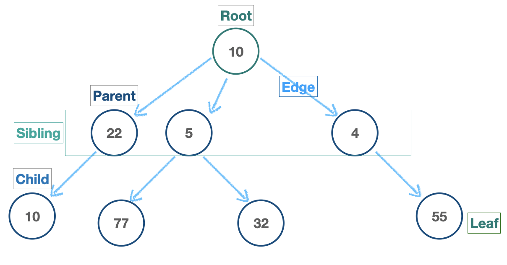
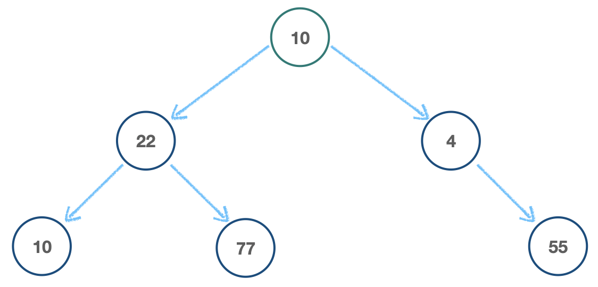
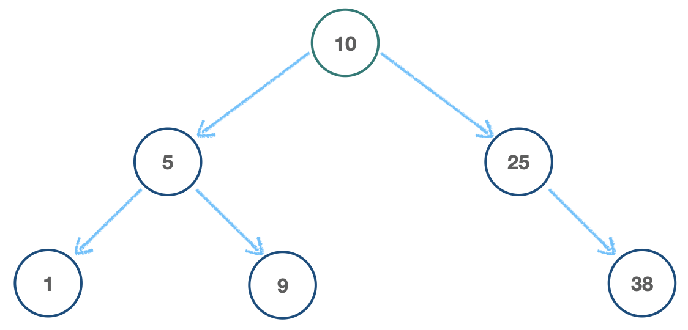

# Tree

- 노드 간 Parent/Child(부모/자식) 관계를 가진 자료구조

  - 예시) HTML DOM, [네트워트 라우팅](https://ko.wikipedia.org/wiki/%EB%9D%BC%EC%9A%B0%ED%8C%85), [추상구문트리](https://ko.wikipedia.org/wiki/%EC%B6%94%EC%83%81_%EA%B5%AC%EB%AC%B8_%ED%8A%B8%EB%A6%AC)(Abstract Syntax Tree), 인공지능(결정 트리), 운영체제 폴더 구조, 컴퓨터 파일 시스템 등

    

  ## Binary Trees(이진 트리)

  - 각 노드가 _최대 두개_ 의 자식 노드를 가지는 트리

    - 예시) 결정 트리(T/F), 데이터베이스 색인(index), 정렬 알고리즘(Sorting)

    

  ## Binary Search Trees(이진 탐색 트리)

  - _좌측 노드_ 에는 부모 노드보다 **작은 값**, _우측 노드_ 에는 부모 노드보다 **큰 값** 이 오는 이진 트리

  - **탐색(Searching)** 에 유리한 자료 구조

    

  ```js
  class Node {
    constructor(val) {
      this.val = val;
      this.left = null;
      this.right = null;
    }
  }

  class BinarySearchTree {
    constructor() {
      this.root = null;
    }

    // Add value to BST
    insert(val) {
      let newNode = new Node(val);
      if (this.root === null) {
        this.root = newNode;
        return this;
      }
      let node = this.root; // current node
      while (true) {
        if (val === node.val) return undefined; // NO duplicates!
        // left
        if (val < node.val) {
          if (node.left === null) {
            node.left = newNode;
            return this;
          }
          node = node.left; // Move downward
          // right
        } else {
          if (node.right === null) {
            node.right = newNode;
            return this;
          }
          node = node.right; // Move downward
        }
      }
    }

    // Search value in BST
    find(val) {
      if (this.root === null) return false;
      let current = this.root,
        found = false;
      while (current && !found) {
        // left
        if (val < current.val) {
          current = current.left;
        } else if (val > current.val) {
          current = current.right;
        } else {
          found = true;
        }
      }
      if (!found) return false;
      return current;
    }

    // Search value in BST(T/F)
    contains(val) {
      if (this.root === null) return false;
      let current = this.root,
        found = false;
      while (current && !found) {
        // left
        if (val < current.val) {
          current = current.left;
        } else if (val > current.val) {
          current = current.right;
        } else {
          return true;
        }
      }
      return false;
    }
  }

  let BST = new BinarySearchTree();
  BST.root = new Node(10);
  BST.insert(5);
  BST.insert(1);
  BST.insert(9);
  BST.insert(25);
  BST.insert(38);
  ```

## Big-O of Binary Search Tree

| Methods                | Time(Best)     | Time(Worst) |
| ---------------------- | -------------- | ----------- |
| Insertion(insert)      | **`O(log n)`** | `O(n)`      |
| Search(find, contains) | **`O(log n)`** | `O(n)`      |

😈Worst Case😈

- 새로운 루트를 선택하고 BST 재구성

  

💚[Big-O Cheatsheet](https://www.bigocheatsheet.com/)
